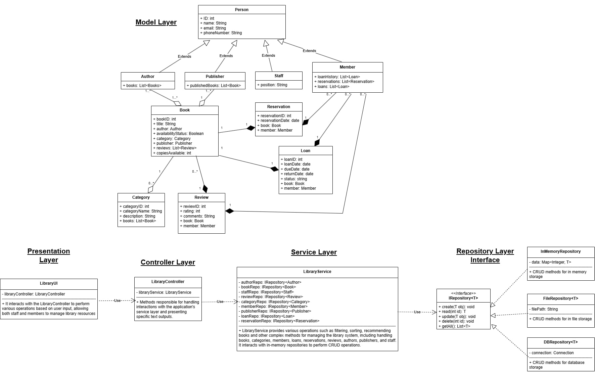

# Library Management System
The library management system is a Java-based application that supports libraries in managing their books, members and lending processes. The application offers a variety of functionalities aimed at making the operation of a library more efficient and user-friendly. The goal is to provide a centralized platform for library staff and members to manage books, track loans and returns, and integrate review and reservation systems.

Main functions of the application:
- Member management: members can register and the system tracks each member's loan and reservation history.
- Book management: Library staff can add books to the system, update books, remove books, check availability and create categories to help organize and search for books.
- Loan management: Members can borrow and return books. The system keeps track of loan periods and calculates possible fees for late returns.
- Reservation system: If a book is currently unavailable, members can create a reservation for that book.
- Review system: Members can leave ratings and reviews for books they have read and returned to help other members choose.

The aim of these functions is to optimize the management and use of library resources and provide a flexible system for daily library work.

